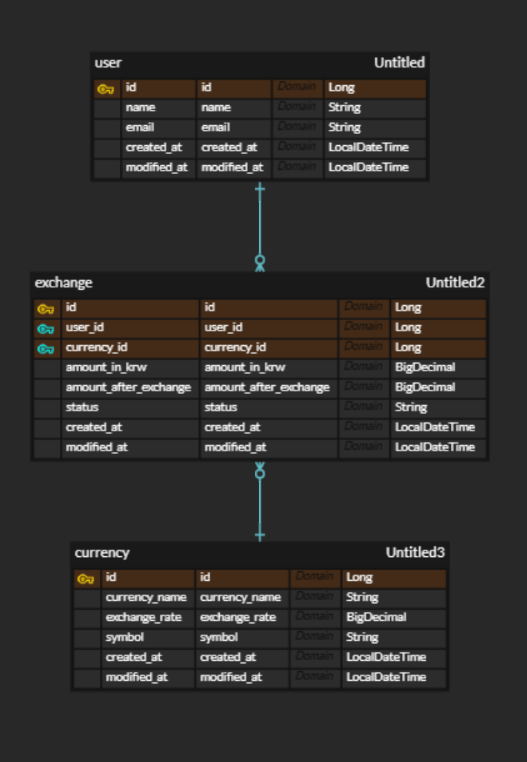

# sparta-assignment

---
1. [환전 서비스 API 명세서](#환전서비스-API-명세서)
2. [ERD](#ERD)
---

## 환전서비스 API 명세서

|    기능     | Method |               URL               | request  | response |    상태코드     |
|:---------:|:------:|:-------------------------------:|:--------:|:--------:|:-----------:|
|   유저 생성   |  POST  |             /users              | 요청 body  |  생성 정보   | 201 : 정상 등록 |
| 전체 유저 조회  |  GET   |             /users              | 요청 param | 다건 응답 정보 | 200: 정상 조회  |
| 특정 유저 조회  |  GET   |           /users/{id}           | 요청 param | 단건 응답 정보 |  200: 정상조회  |
|   유저 삭제   | DELETE |           /users/{id}           | 요청 body  |    -     | 200: 정상 삭제  |
|   통화 생성   |  POST  |           /currencies           | 요청 param |  응답 정보   | 201: 정상 생성  |
| 전체 통화 조회  |  GET   |           /currencies           | 요청 body  | 다건 응답 정보 | 200: 정상 조회  |
| 특정 통화 조회  |  GET   |           /currencies           | 요청 param  | 단건 응답 정보 | 200: 정상 조회  |
|   환전하기    |  POST  |       /exchange/{userId}        | 요청 param  |    생성 정보     | 201: 정상 생성  |
| 전체 환전 조회  |  GET   |             /exchange           | 요청 param  | 다건 응답 정보 | 200: 정상 조회  |
| 고객별 환전 조회 |  GET   |       /exchange/{userId}        | 요청 param  | 단건 응답 정보 | 200: 정상 조회  |
| 환전 요청 취소  | PATCH  | /exchange/{userId}/{exchangeId} | 요청 body  |  수정 정보   | 200: 정상 수정  |
| 환전 요청 삭제  | DELETE | /exchange/{userId}/{exchangeId} | 요청 body  |    -     | 200: 정상 삭제  |

 

## ERD

